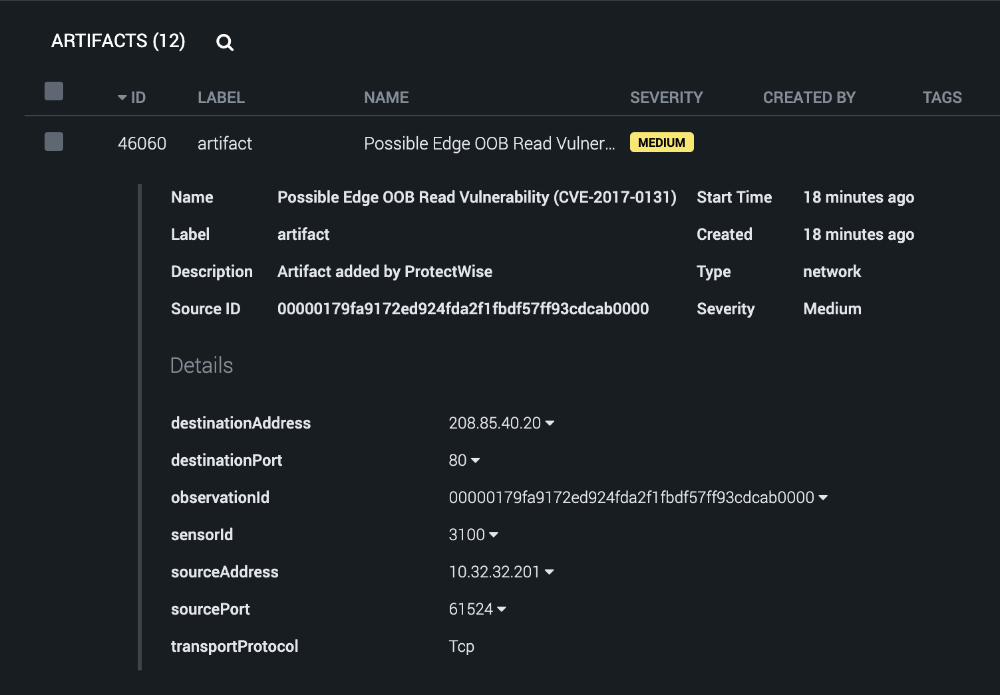

The ProtectWise app enables the collection of events and the corresponding related observations into
containers and artifacts in Phantom.

The first thing to do is create the ProtectWise asset in Phantom.\
It's good practice to set the Label of the objects from this source to a **NEW ENTRY** called
**Event** .\
Once the asset is saved, run Test Connectivity and make sure it passes.\
The Test connection action is successful only when the session is created and the REST API call is
made successfully.

## Containers created

The app will create a single container for each Event that it ingests from ProtectWise.

## Event Artifact

Every Event in ProtectWise is made up of Observations. Each Observation is ingested and added as an
Artifact into the created Container. 

The fields that are present in the artifact greatly depend upon the type of Observation that was
ingested. Different Observations will have different types of values in the artifacts.\
The app supports two modes of ingestion, let's discuss the differences between them.

## POLL NOW

POLL NOW should be used to get a sense of the containers and artifacts that are created by the app.
The POLL NOW dialog allows the user to set the "Maximum containers" that should be ingested at this
instance. Since a single container is created for each event, this value equates to the maximum
events that are ingested by the app. The app will fetch the events in the order they were created in
ProtectWise. The time interval can be configured in hours using the **poll_hours** asset config,
E.g. to ingest events that have been generated in the last 2 hours, configure this value to be 2.
However, the query to ingest this data can be quite time-consuming.

## Scheduled Polling

This mode is used to schedule a polling action on the asset at regular intervals, which is
configured via the INGEST SETTINGS tab of the asset. It makes use of the following asset
configuration parameters (among others):

- Maximum events to poll the first time

  The app detects the first time it is polling an asset and will ingest this number of events (at
  the most). It will also use the **poll_hours** value.

- Maximum Containers for scheduled polling

  For all scheduled polls after the first, the app will ingest this number of events.

In case of Scheduled Polling, on every poll, the app remembers the time of the last event that it
has ingested and will pick up from the same time in the next polling cycle. For best results, keep
the poll interval and *Maximum Containers for scheduled polling* values close to the number of
events you would get within a time interval. This way, every poll will end up ingesting all the new
events.\
It is also very important that the *Maximum Container for scheduled polling* configured should be
greater than the maximum events that are generated **per second** . If the app detects it got the
maximum configured events and all occurred in the same second, it will start polling from the next
second in the next polling cycle.
